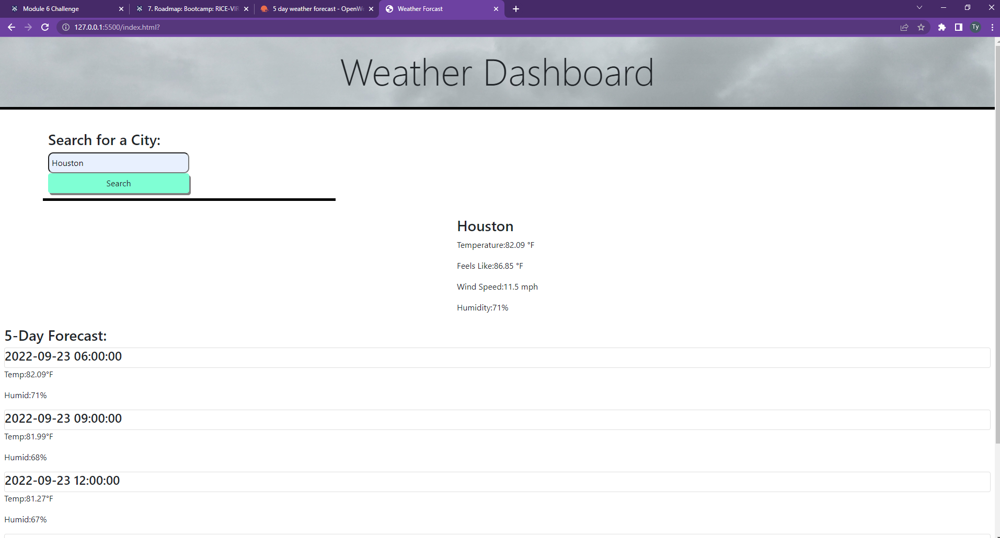

# Weather Me
5 day weather app

## Description
A weather forecast for any city you need whether you travel or not
- I wanted to test my knowledge of full stack and I have found I love the backend.
- So once again I have made majority of my coding time into js
- This has shown me I dont like designing the look of a webpage but I do like css.
- I've found I put more learning into js and css styles, more so on my js.

## Usage 
Just type in the city name and let the code do its thing, I will need to figure out why it isnt saving but Im a lil sleepy and late on this already.

## Built With
* HTML
* CSS
* JavaScript/jQuery
* Bootstrap
* Openweather API

## Website
https://tyfb.github.io/weather-me/

## License
MIT license